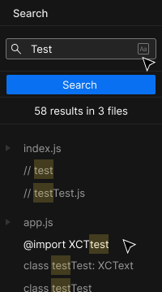
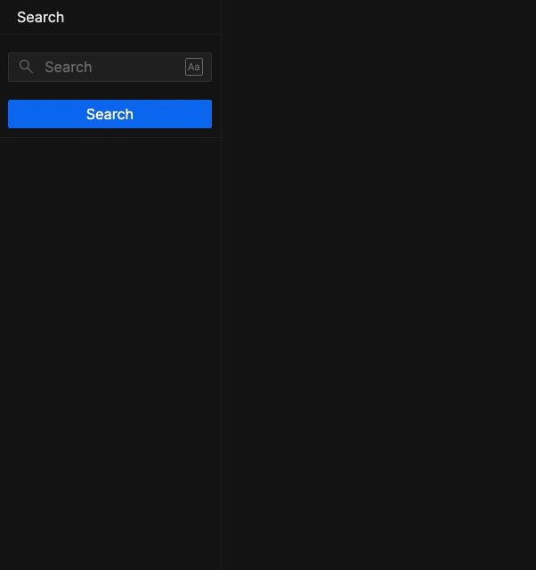

# README

Hi! We're really happy to see you here and thank you for taking the time to do this exercise!

## Problem statement

Given a sandbox, a developer should be able to search across files for a keyword. (Please see figma file below for design)

## Instructions

1. Please fork this sandbox.

2. Here is the design specification for the feature: [Figma file](https://www.figma.com/file/LI16eJsspGT5FpFRJKUPJm/File-search-assignment/duplicate).

3. To get files, use this open API: [https://codesandbox.io/api/v1/sandboxes/84jkx](https://codesandbox.io/api/v1/sandboxes/84jkx). The relevant field is `data.modules`.

4. The theme (colors, fontsizes, etc.) used in the Figma example is available in `src/theme/` as css variables and javascript both. You are free to use either of them.

5. All the icons from design are in the `src/icons.js`. The Icon component are 16px by 16px by default. The component accepts a `size` prop.

6. Please feel free to add any libraries that you need.

7. After implementing your solution, you can reply to the email with a link to your solution sandbox.

8. According to our measurement, this assignment takes about 2-3 hours. Please do not spend too much time on it.

## Features

1. You can search for a keyword in the contents of all files inside a sandbox (sandbox id can be hardcoded)

2. By default, the query is case-insensitive. Example: `React` should return both `React` and `react`

3. When "Match case" (`Aa`) is toggled on,it should only search for the case mentioned. Example: `React` should return `React`, but not `react`

4. The list of results is grouped by file name. The search term is highlighted in the result. (see Figma file for design)

5. It should search on `Enter` or when you click the Search button.

## What are we looking for?

1. Attention to detail
2. Accuracy of implementation of features
3. Polish of the UI
4. Structure of the code

## How to use the Figma file

- Open this file - [Figma link](https://www.figma.com/file/LI16eJsspGT5FpFRJKUPJm/File-search-assignment/duplicate)
- Figma would prompt you to log in/create an account to be able to see the colors, fontsizes, etc.
- After logging in, you would be able to see the color, font sizes and space used in the file. Example: `Blues 600`, the name of colors and font size match what's available in `src/theme`.
- The font used in the file is [Inter](https://rsms.me/inter/), and is already added to `styles.css`

## Help?

If you have any doubts, please feel free to reply to the email you recieved with this assignment.

## Example

Here's an example implementation.

(You do not have to replicate this exactly, this is only for reference)

